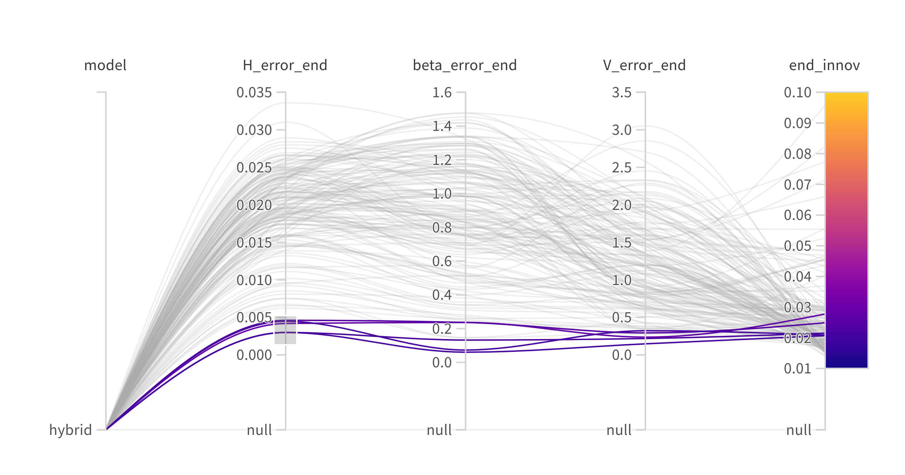
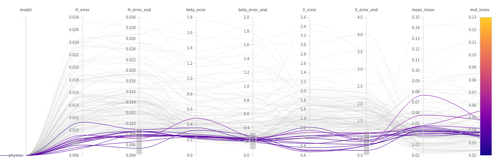
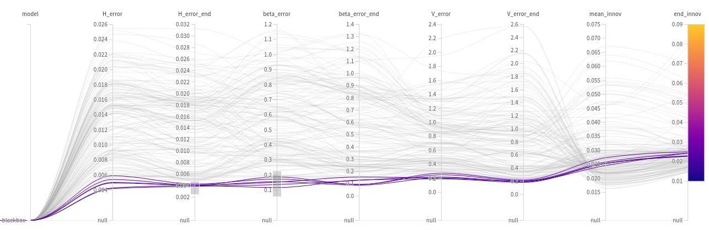

# Tuning with WandB
This README serves as additional information on the tuning process. Tuning is performed by running scripts/tuning.py.
For each model a WandB sweep has been setup (https://wandb.ai/cevheck/experimental-DEKF_25_02/sweeps) resulting in the following number of combinations evaluated (@21/04/2024, 12AM):

	- H-PDEKF: 162
	- p-PDEKF: 144
	- n-PDEKF 167

Additionally manual tuning is also performed. Results (certain settings) from this tuning can be evaluated using scripts/tuning_evaluation.py. Best results are displayed below for each of the modeltypes and a single hyperparameter settings for each has been chosen to create the results. For both hybrid model and neural model, the neural network uncertainty ($Q_alpha$) was still varied (Fig 5) to evaluate performance since this parameter showed a big difference for varying structures.

## H-PDEKF
The Figure shows the results of the tuning grid. Some combinations can be taken, however there is always a trade-off between the performance of the different metrics and hence this is a custom decision. Some of the best combinations are listed below, where we focus on the final (converged) values.

	- 1.:
		- H_error_end: 0.0025404
		- beta_error_end: 0.072518
		- V_error_end: 0.21716
		- end_innov: 0.020910
	- 2.:
		- H_error_end = 0.002971
		- beta_error_end = 0.05935
		- V_error_end = 0.1451
		- end_innov = 0.02066
	- 3.:
		- H_error_end = 0.002965
		- beta_error_end = 0.1312
		- V_error_end = 0.2161
		- end_innov = 0.02147
		

## p-PDEKF
The Figure shows the results of the tuning grid. Some combinations can be taken, however there is always a trade-off between the performance of the different metrics and hence this is a custom decision. Some of the best combinations are listed below, where we focus on the final (converged) values.

	- 1.:
		- H_error_end = 0.006941153
		- beta_error_end = 0.24057728
		- V_error_end = 0.7607415
		- end_innov = 0.035934124
	- 2.:
		- H_error_end = 0.005331
		- beta_error_end = 0.2787
		- V_error_end = 0.7783
		- end_innov = 0.03416
	- 3.:
		- H_error_end = 0.007879
		- beta_error_end = 0.1952
		- V_error_end = 0.8149
		- end_innov = 0.03579

## n-PDEKF
The Figure shows the results of the tuning grid. Some combinations can be taken, however there is always a trade-off between the performance of the different metrics and hence this is a custom decision. Some of the best combinations are listed below, where we focus on the final (converged) values.

	- 1.:
		- H_error_end = 0.003914
		- beta_error_end = 0.1275
		- V_error_end = 0.1912
		- end_innov = 0.02272
	- 2.:
		- H_error_end = 0.004036
		- beta_error_end = 0.1295
		- V_error_end = 0.1816
		- end_innov = 0.02301
	- 3.:
		- H_error_end = 0.004091
		- beta_error_end = 0.08718
		- V_error_end = 0.2007
		- end_innov = 0.02447

